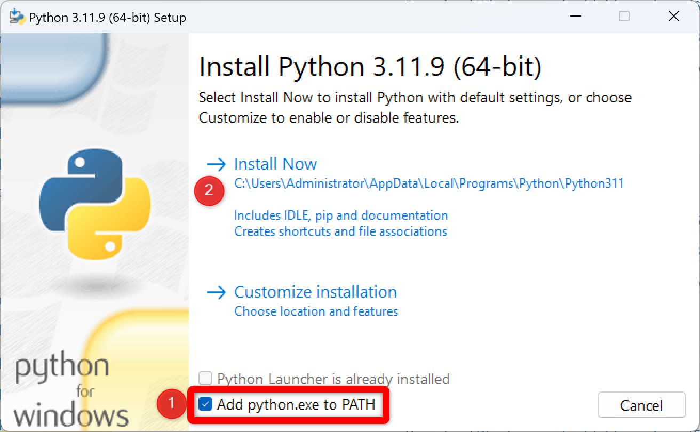

<div style="text-align: justify">

(windows)=
# Windows

Direto e reto, siga todas as instruções sem pular etapas!

## Passo 1: baixar o instalador do Python

- Navegue até <a href="https://www.python.org/downloads/" target="_blank">página oficial de download do Python</a>
- Baixe o instalador clicando no botão de download do Python.

```{admonition} Nota
:class: note
O site geralmente oferece a versão mais recente, como *Python 3.x.x*.
Saber detalhes sobre a versão é importante, e haverá uma seção específica para este tema mais à frente.
```

## Passo 2: executar o instalador

- Localize o arquivo baixado (normalmente na pasta "Downloads") e clique duas vezes para abrir.
- Marque a opção **Add python.exe to PATH**.

`````{admonition} Atenção
:class: danger
Caso você não marque a opção **Add python.exe to PATH** você terá erros no futuro!
`````

- Clique em *Install now*.
- Aguarde a instalação ser concluída (pode demorar alguns minutos).



## Passo 3: verificando a instalação

- Abra o prompt de comando (busque por `cmd` na barra de busca do Windows)
- No prompt de comando (tela preta que abriu), digite `python --version` e pressione Enter. Você deve ver a versão do Python instalada impresa no terminal, conforme abaixo, confirmando que o Python foi instalado com sucesso! Parabéns!

```bash
C:\Users\Administrator>python --version
Python 3.11.9
```
</div>